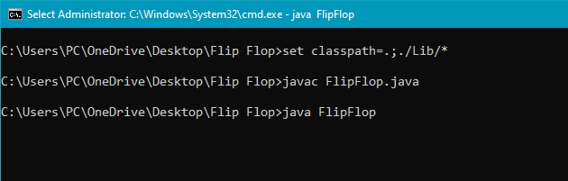

# Java Flip Flop Memory Game
Exercise your memory and have fun with Java-based Flip Flop Memory Game

## Skills Demonstrated
* Java programming
* Graphical User Interface (GUI) design using NetBeans
* Multi-threading implementation
* File handling
* Database Integration (accdb)
* Error Handling

## How to Run the Game
* Clone this Repo using "git clone https://github.com/khuzaima-a/java-flip-flop-game.git"
* Open your command prompt and navigate to the project folder
* Set the classpath to include the necessary libraries: "set classpath=,;,/Lib/*"
* Compile the program using "javac FlipFlop.java"
* Execute the compiled program "java FlipFlop"

## How To Play
* Press the "Start Game" button
* Click on cards to flip them over and reveal their faces
* Your objective is to find matching pairs of cards in least possible time
* Keep an eye on the timer display to track your progress
* If two flipped cards match, they will remain face up
* If the cards do not match, they will flip back face down after a short delay
* Complete the game by matching all pairs in the least amount of time

![Game][game.PNG]

